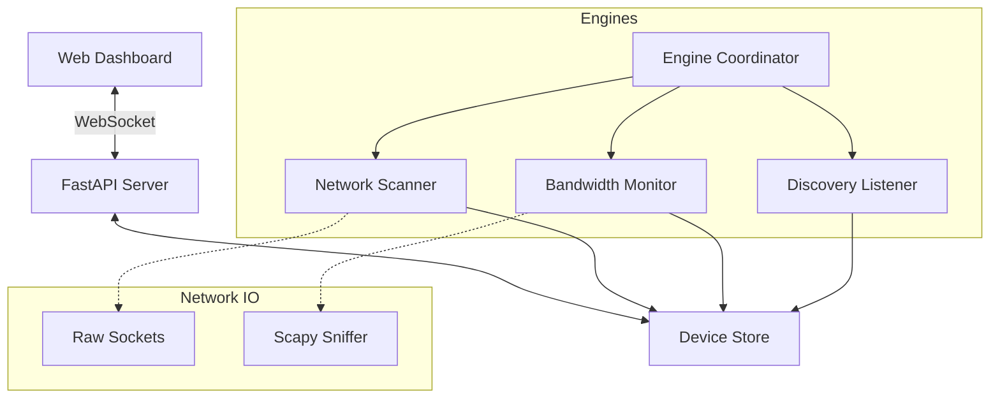

# AgentX: Network Inspector & Security Toolkit

AgentX is a high-performance network monitoring and security application. It provides real-time visibility into local network devices, bandwidth usage, and active domains, featuring a "Kill Switch" to terminate internet access for unauthorized or high-bandwidth nodes.

## Features

- **Device Discovery**: Combines ARP scanning, passive ARP listening, and mDNS/SSDP discovery for near-instant device detection.
- **Traffic Analysis**: Real-time upload/download tracking using Scapy with SNI/DNS sniffing for domain logging.
- **Network Control**: Selective internet blocking (ARP spoofing) and a global "Kill Switch" for the entire local network.
- **Dynamic Configuration**: Adjust scan intervals, select network interfaces, and enable "Paranoid Mode" directly from the UI.
- **Homebrew Theme UI**: A custom, terminal-inspired web dashboard with integrated "System Configuration" management.
- **Reliable Backend**: Multi-threaded architecture with a central `EngineCoordinator` and persistent `SettingsManager`.

## Installation

### Prerequisites

- **Python 3.9+**
- **Sudo Privileges**: Required for raw socket access (sniffing and ARP spoofing).
- **macOS / Linux**: Optimized for macOS BPF and Linux raw sockets.

### Setup

1. **Clone the repository**:
   ```bash
   git clone https://github.com/avi-xyz/AgentX.git
   cd AgentX
   ```

2. **Install dependencies**:
   ```bash
   pip install -r requirements.txt
   ```

## Usage

Start the server using `sudo` to ensure the networking engines have the necessary permissions:

```bash
sudo python3 -m uvicorn src.server:app --host 0.0.0.0 --port 8000
```

Access the dashboard at `http://localhost:8000`.

## Architecture

AgentX uses a decoupled multi-threaded architecture to ensure the web server remains responsive regardless of network traffic volume.

### Core Components



1.  **FastAPI Server**: Handles REST API requests and real-time WebSocket state updates.
2.  **Engine Coordinator**: Manages the lifecycle (start/stop) of all background threads.
3.  **Bandwidth Monitor**: Performs active ARP spoofing for blocking and sniffs traffic for statistics.
4.  **Network Scanner**: Performs periodic active ARP scans and stays active for passive discovery.
5.  **Device Store**: A thread-safe, persistent data layer for device metadata and history.

## Shutdown

To stop the server, press `Ctrl+C`. The application implements a graceful shutdown mechanism that restores ARP tables for any blocked devices before exiting.

---
*Created for the AntiGravity Project.*
